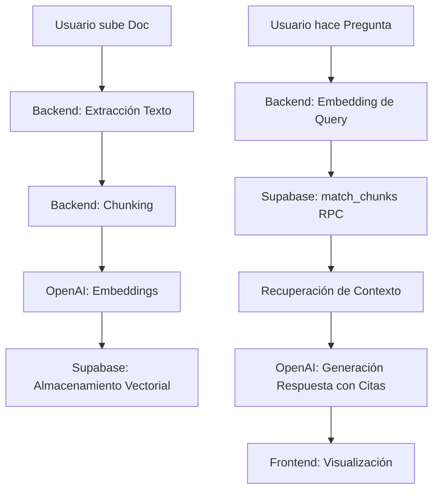

# 📋 Documentación Técnica: Multi-Asistente RAG

Este documento detalla la arquitectura, decisiones de diseño y procesos técnicos de la aplicación **Multi-Asistente RAG**, una plataforma full-stack para la gestión de asistentes inteligentes basados en documentos propios.

---

## 1. Descripción del Producto

**Problema que resuelve:** Las organizaciones y usuarios individuales suelen tener grandes volúmenes de documentos (PDFs, manuales, actas) que son difíciles de consultar rápidamente. Los LLMs estándar (como ChatGPT) pueden "alucinar" o inventar información si no tienen acceso directo a estos documentos privados.

**Qué hace la aplicación:** 
- Permite crear múltiples "Asistentes" con personalidades e instrucciones únicas.
- Cada asistente tiene un repositorio de documentos privado.
- El usuario puede chatear con el asistente, y este responderá **basándose exclusivamente** en los documentos cargados, citando las fuentes exactas y negándose a responder si la información no está presente.

---

## 2. Stack Tecnológico

| Capa | Tecnología | Razón |
|---|---|---|
| **Frontend** | Next.js 14 (App Router) | React moderno con optimización de rutas y facilidad de despliegue. |
| **Backend** | FastAPI (Python 3.10+) | Alto rendimiento, tipado estático con Pydantic y excelente integración con librerías de IA. |
| **Base de Datos** | Supabase (PostgreSQL) | Ofrece soporte nativo para `pgvector` y gestión de Auth/Storage integrada. |
| **Vector DB** | pgvector | Extensión de Postgres para búsqueda de similitud por coseno a gran escala. |
| **LLM / AI** | OpenAI / Azure OpenAI | Modelos líderes (`gpt-4o-mini`) y embeddings de alta calidad (`text-embedding-3`). |

---

## 3. Arquitectura Implementada

### Diagrama de Flujo RAG


### Componentes Clave
- **Aislamiento**: Cada fila en `document_chunks` está vinculada a un `assistant_id`.
- **Stateless Backend**: El backend no guarda estado; confía en el JWT de Supabase para identificar al usuario y en la base de datos para la memoria.

---

## 4. Decisiones de Diseño

### Técnicas
- **Chunking Recursivo**: Se utiliza `RecursiveCharacterTextSplitter` con un tamaño de 800 caracteres y un solapamiento de 150. Esto garantiza que el contexto no se corte abruptamente a mitad de una frase.
- **RPC para Búsqueda Vectorial**: En lugar de traer todos los vectores al backend, se utiliza una función SQL (`match_chunks`) dentro de Supabase. Esto reduce drásticamente la latencia y el consumo de memoria del servidor.
- **Temperatura Baja (0.2)**: Se configuró una temperatura baja en el LLM para priorizar la precisión y fidelidad al texto original frente a la creatividad.

### Producto / UX
- **Citas Colapsables**: Para no saturar la interfaz de chat, las fuentes utilizadas se muestran en un componente desplegable debajo de cada mensaje del asistente.
- **Lanzador Automatizado (`run_app.bat`)**: Se implementó para simplificar la barrera de entrada al desarrollo local, manejando entornos virtuales y variables de entorno de forma transparente.

---

## 5. Guía de Ejecución Local

### Paso 1: Configuración de Base de Datos (Supabase)
Ejecuta el siguiente SQL en el editor de Supabase para habilitar vectores y la función de búsqueda:

```sql
CREATE EXTENSION IF NOT EXISTS vector;

-- Función de búsqueda con aislamiento por asistente
CREATE OR REPLACE FUNCTION match_chunks(
  query_embedding VECTOR(1536),
  match_assistant_id UUID,
  match_count INT DEFAULT 5,
  match_threshold FLOAT DEFAULT 0.5
)
RETURNS TABLE (id UUID, document_id UUID, content TEXT, metadata JSONB, similarity FLOAT)
LANGUAGE SQL STABLE AS $$
  SELECT dc.id, dc.document_id, dc.content, dc.metadata, 1 - (dc.embedding <=> query_embedding) AS similarity
  FROM document_chunks dc
  WHERE dc.assistant_id = match_assistant_id AND 1 - (dc.embedding <=> query_embedding) > match_threshold
  ORDER BY dc.embedding <=> query_embedding LIMIT match_count;
$$;
```

### Paso 2: Variables de Entorno
Crea un archivo `.env` en la raíz (puedes copiar el `.env.example`) con tus keys:
- `SUPABASE_URL` / `SUPABASE_SERVICE_KEY`
- `AZURE_OPENAI_CHAT_KEY` (o `OPENAI_API_KEY`)

### Paso 3: Lanzamiento
Simplemente ejecuta:
```bash
.\run_app.bat
```
*Accede a http://127.0.0.1:3000*

---

## 6. Cumplimiento del Core

### 🔒 Aislamiento por Asistente
El aislamiento no es solo a nivel de aplicación, sino de base de datos. Cada fragmento de documento (`document_chunk`) posee una columna `assistant_id`. La función `match_chunks` **obliga** a pasar un ID de asistente, filtrando los resultados antes de cualquier cálculo de similitud. Es matemáticamente imposible que un asistente recupere información de otro.

### 🧠 Persistencia de Memoria
La memoria no se basa en el estado del servidor (stateless). Cada mensaje se guarda en la tabla `messages`. Al enviar un nuevo mensaje, el backend recupera los últimos 10 mensajes de la conversación (`conversations`) y los inyecta en el prompt del sistema, permitiendo que el asistente recuerde el hilo de la charla.

### 📑 Citas y "No Inventar"
El comportamiento se garantiza mediante un **System Prompt** estricto:
1. Se le indica al modelo que responda **ÚNICAMENTE** basándose en el contexto proporcionado.
2. Si la similitud semántica es baja o no hay fragmentos, el backend envía un mensaje vacío de contexto y el modelo responde con una frase predefinida de "No tengo información".
3. Se obliga al modelo a usar la notación `[Fragmento X]` para cada afirmación, la cual es luego procesada por el frontend para mostrar la fuente original.
