# 📋 Documentación Técnica: Multi-Asistente RAG

Este documento detalla la arquitectura, decisiones de diseño y procesos técnicos de la aplicación **Multi-Asistente RAG**.

---

## 1. Descripción del Producto

**Problema que resuelve:**  
Las organizaciones y usuarios individuales acumulan grandes volúmenes de documentos (PDFs, manuales, actas) que son difíciles de consultar rápidamente. Los LLMs estándar (como ChatGPT) pueden "alucinar" o inventar información si no tienen acceso directo a estos documentos privados, lo que los hace poco fiables para tareas críticas.

**Qué hace la aplicación:**  
Es una plataforma full-stack que permite:
- Crear múltiples "Asistentes" (agentes) con personalidades e instrucciones únicas.
- Dotar a cada asistente de un repositorio de documentos propio y aislado.
- Chatear con el asistente para que responda **basándose exclusiva y estrictamente** en los documentos cargados. Si no tiene la información, está programado para negarse a responder y notificarlo, eliminando así las alucinaciones.

---

## 2. Stack Tecnológico

| Capa | Tecnología | Razón de elección |
|---|---|---|
| **Frontend** | Next.js 14 (App Router) + Tailwind CSS | Ecosistema React moderno con optimización de rutas, renderizado rápido y facilidad para construir interfaces dinámicas. |
| **Backend** | FastAPI (Python) | Alto rendimiento, validación de datos estricta (Pydantic) y el mejor ecosistema para procesamiento de IA y NLP (Langchain, OpenAI). |
| **Base de Datos** | Supabase (PostgreSQL) | Plataforma todo-en-uno que ofrece Auth, Storage y soporte nativo para almacenamiento vectorial. |
| **Vector DB** | pgvector (Extensión de Postgres) | Permite realizar búsquedas de similitud por coseno a gran escala directamente en la base de datos relacional. |
| **LLM / AI** | Azure OpenAI (gpt-4o-mini & text-embedding-3) | Modelos líderes en el mercado para generación de respuestas contextuales y embeddings de alta calidad. |

---

## 3. Arquitectura Implementada

### Diagrama de Flujo RAG

```mermaid
graph TD
    subgraph Ingesta de Datos
    A[Usuario sube Doc] --> B[Backend: Extracción de texto]
    B --> C[Backend: Chunking Recursivo]
    C --> D[OpenAI: Generación de Embeddings]
    D --> E[(Supabase: Almacenamiento Vectorial)]
    end
    
    subgraph Generación de Respuestas
    F[Usuario hace Pregunta] --> G[Backend: Embedding de Query]
    G --> H[(Supabase: match_chunks RPC)]
    H --> I[Recuperación de Contexto Aislado]
    I --> J[OpenAI: LLM con System Prompt Estricto]
    J --> K[Frontend: Visualización de Respuesta y Fuentes]
    end
```


---

## 4. Decisiones de Diseño

### Decisiones Técnicas
- **Chunking Recursivo**: Se utiliza `RecursiveCharacterTextSplitter` (tamaño de 800 caracteres, solapamiento de 150). Esto asegura que el contexto no se corte de forma abrupta a mitad de una frase, manteniendo el significado semántico para el embedding.
- **RPC para Búsqueda Vectorial (`match_chunks`)**: En lugar de traer todos los vectores al backend y filtrarlos allí (lo que colapsaría la memoria), el cálculo de similitud del coseno se hace directamente dentro de Supabase mediante una función SQL.
- **Lanzador Node.js (`start.js`)**: Se optó por un script unificado en Node.js para el entorno local en lugar de scripts `.bat`. Esto unifica los logs del frontend y el backend en una sola terminal, facilitando la depuración y evitando la molesta apertura de múltiples ventanas.

### Decisiones de UX / Producto
- **Citas Colapsables**: Para mantener una interfaz de chat limpia y "premium", las fuentes de donde el modelo extrae la información se muestran en un componente desplegable (`<details>`) debajo del mensaje.
- **Tono Conversacional Mixto**: El asistente puede responder a saludos de forma natural, pero tiene una barrera estricta para preguntas informativas. Esto mejora la experiencia del usuario sin sacrificar la fiabilidad del RAG.

---

## 5. Guía de Ejecución Local

### Paso 1: Configurar Variables de Entorno
Crea un archivo `.env` en la raíz copiando la estructura de `.env.example`:
- `SUPABASE_URL` / `SUPABASE_SERVICE_KEY` / `SUPABASE_ANON_KEY`
- `AZURE_OPENAI_CHAT_KEY` y `AZURE_OPENAI_EMBEDDING_KEY` (o equivalentes de OpenAI)

### Paso 2: Base de Datos (Supabase)
Ejecuta la migración en tu proyecto de Supabase para crear las tablas y la función de búsqueda:
```sql
CREATE EXTENSION IF NOT EXISTS vector;

CREATE OR REPLACE FUNCTION match_chunks(
  query_embedding VECTOR(1536), match_assistant_id UUID, match_count INT DEFAULT 5, match_threshold FLOAT DEFAULT 0.5
) RETURNS TABLE (id UUID, document_id UUID, content TEXT, metadata JSONB, similarity FLOAT)
LANGUAGE SQL STABLE AS $$
  SELECT dc.id, dc.document_id, dc.content, dc.metadata, 1 - (dc.embedding <=> query_embedding) AS similarity
  FROM document_chunks dc
  WHERE dc.assistant_id = match_assistant_id AND 1 - (dc.embedding <=> query_embedding) > match_threshold
  ORDER BY dc.embedding <=> query_embedding LIMIT match_count;
$$;
```

### Paso 3: Arrancar la Aplicación
Asegúrate de tener instalado Node.js y Python. Abre tu terminal en la raíz del proyecto y ejecuta:
```bash
node start.js
```
*Accede a **http://localhost:3000** en tu navegador. El script manejará tanto el frontend como el backend.*

---

## 6. Cumplimiento del Core

### 🔒 Aislamiento por Asistente en el Retrieval
El aislamiento está garantizado a **nivel de base de datos**. Cada fragmento de texto (`document_chunk`) posee una columna `assistant_id`. La función RPC `match_chunks` recibe el `match_assistant_id` y **filtra la tabla antes** de realizar cualquier cálculo de similitud. Es matemáticamente imposible que un asistente recupere el contexto de otro asistente, asegurando privacidad total.

### 🧠 Persistencia del Chat y Memoria
La memoria es completamente **stateless (sin estado en el servidor)**. Cada mensaje se almacena permanentemente en la tabla `messages` de Supabase. Cuando un usuario envía un nuevo mensaje, el backend consulta los últimos N mensajes de esa `conversation_id` específica y los inyecta dinámicamente en el array de mensajes del LLM. Esto permite retomar chats antiguos sin que el servidor consuma memoria RAM.

### 📑 Citas y Comportamiento "No Inventar"
Este comportamiento se fuerza mediante dos mecanismos:
1. **System Prompt Draconiano**: Se le instruye al LLM que su único propósito es buscar en el contexto. Si no hay contexto o la respuesta no está, tiene la orden de abortar y decir "No dispongo de esa información en mis documentos".
2. **Temperatura del LLM**: Configurada a un valor bajo (`0.2`) para reducir la creatividad y forzar respuestas deterministas basadas en el input.
3. **Fuentes Desplegables**: El backend extrae los fragmentos relevantes y los envía en un array estructurado de `sources`. El frontend toma estos fragmentos y los renderiza en un elemento HTML colapsable vinculado a cada respuesta, permitiendo al usuario auditar de qué documento y fragmento exacto provino la información.
